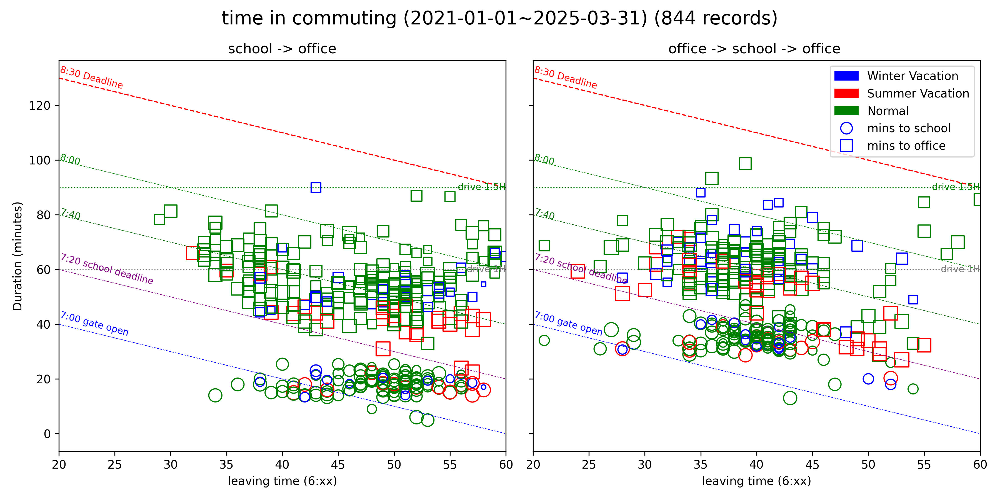
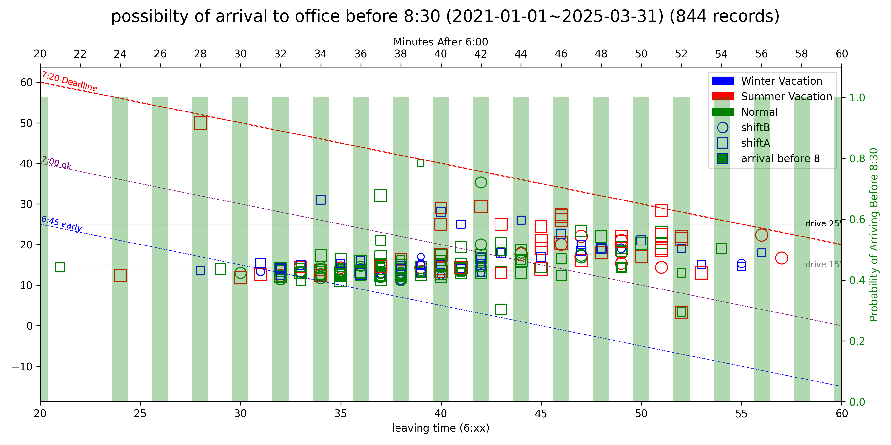

Purpose :
By [`teslamate`](https://github.com/teslamate-org/teslamate) date, calculate the time I arrival to school/office
take data from Teslamate's databse in Postgresql

Requirement:
`Python 3.9+`
`psycopg == 3.2.6` `pandas == 2.2.3` `sqlalchemy` `matplotlib == 3.9.4` `seaborn == 0.13.2` `numpy ==1.26.4`

result

2025/04